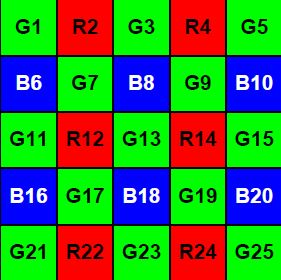
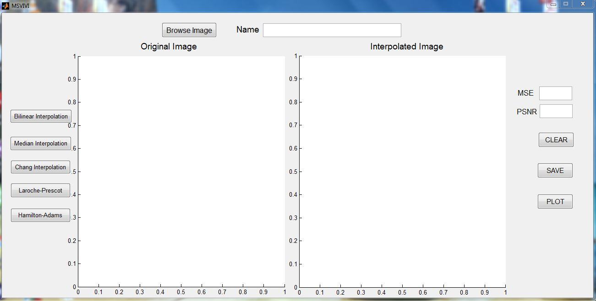
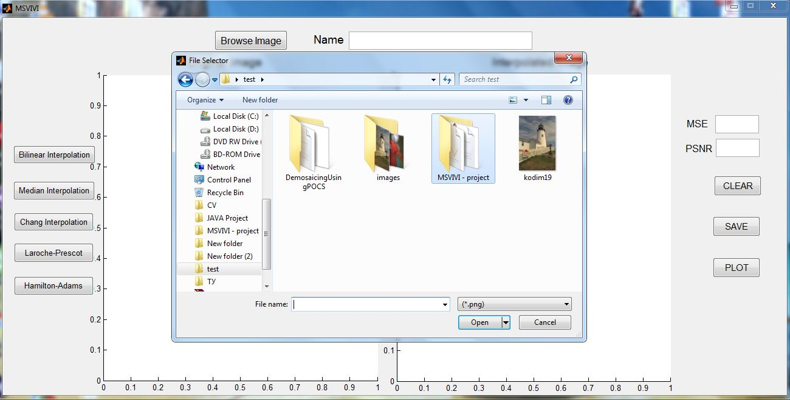
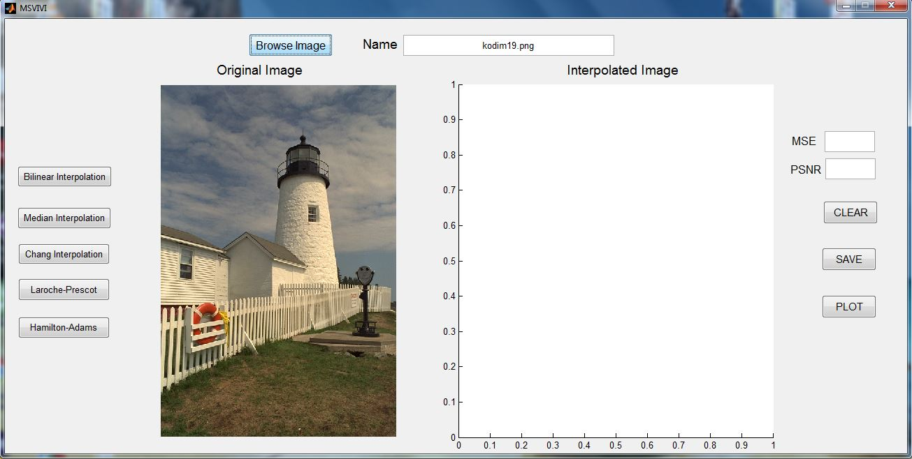
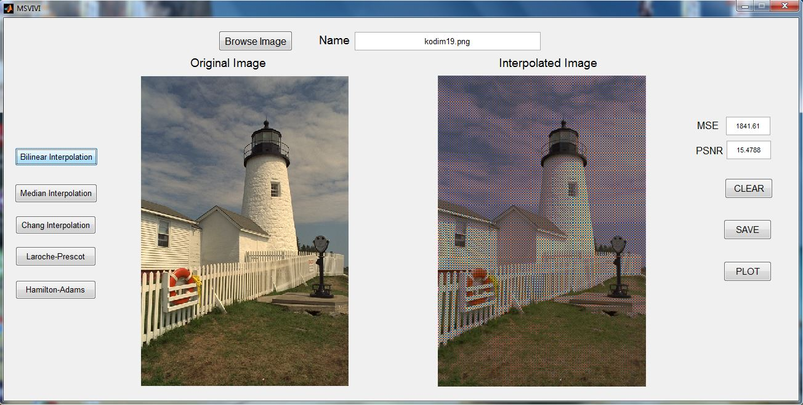
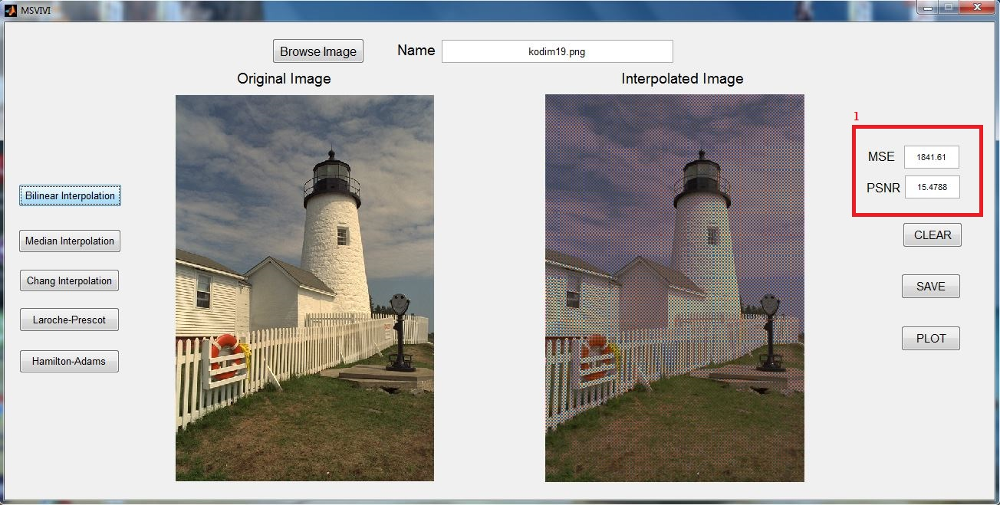
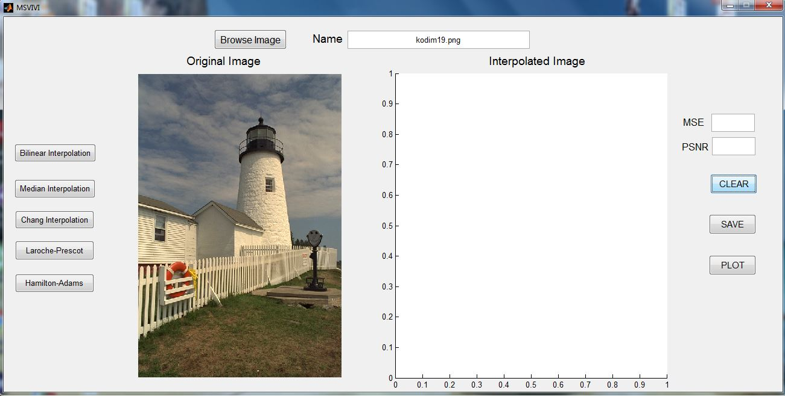
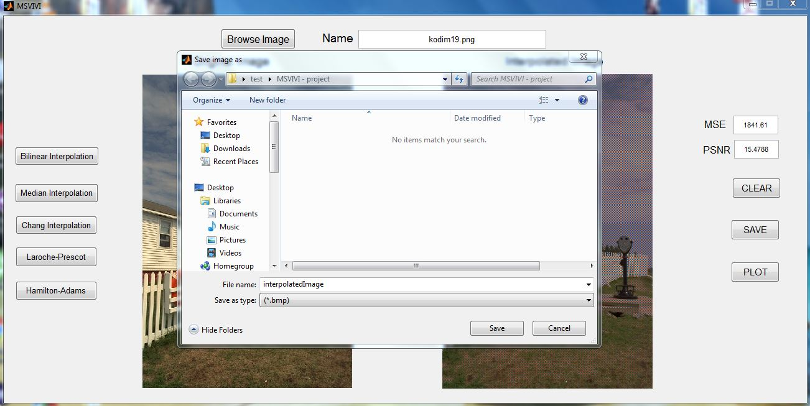
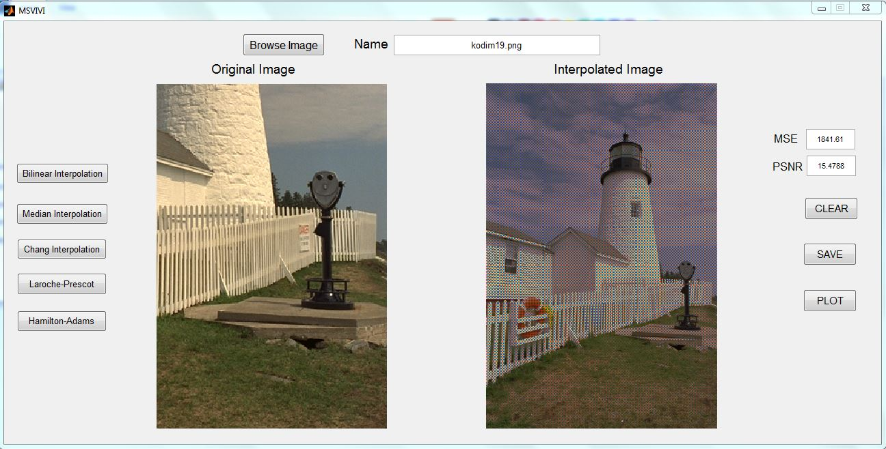

# Bayer-filter-for-interpolation-algorithms

Main task: 

**Perform the following algorithms using a Bayer filter: **

♦ bilinear interpolation; 
♦ median interpolation (Freeman); 
♦ interpolation using variable number of gradients (Chang); 
♦ gradient interpolation (Laroche-Prescott); 
♦ adaptive interpolatiob (Hamilton-Adams). 

*The Bayer filter that was used has the following pattern:*

*Screenshots of the program:*

- Main screen that appears on opening:

- Dialog window that appears when the user clicks on the "Browse" button:

- Selected image appears on the left side of the screen:

- Interpolated image appears on the right after the user clicks on one of the interpolation algorithms (each algorithm is displayed with a button):

- MSE/PSNR calculation appear on the right side after each interpolation on the image:

                                                                                 
- The user can click on the "CLEAR" button on the right to remove the interpolated image. After that the user can perform another interpolation on the same image that was previously uploaded:

- Dialog window that appears after the user clicks on the "SAVE" button:

- The user can zoom on part of the image:

- Zoomed part of the original image (left) and interpolated image (right). Interpolation errors can be seen clearly.

